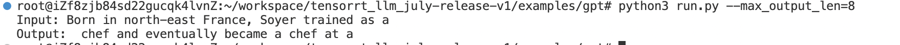
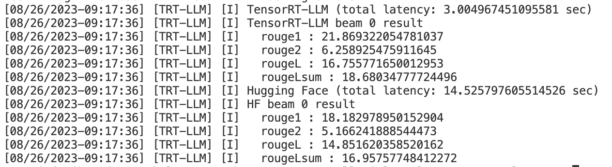

### 总述

本工作是 [NVIDIA TensorRT Hackathon 2023](https://github.com/NVIDIA/trt-samples-for-hackathon-cn/tree/master/Hackathon2023) 的参赛题目，具体的规则和相关的选题请查看如上链接。

关于选题方面，我组选择的是

* 题2.用TensorRT-LLM实现新模型。新模型为自动驾驶行业的端到端大模型[UniAD](https://github.com/OpenDriveLab/UniAD)

* 题4.为TensorRT-LLM添加新feature，或者在模型上启用了现有feature。将现有的SmoothQuant在模型上启用
 

使用步骤
``` bash
# step 1: 下载模型文件
mkdir example/uniad/ckpt && cd example/unid/ckpt && wget https://github.com/OpenDriveLab/UniAD/releases/download/v1.0.1/uniad_base_e2e.pth

# step 2: pth 分层保存
cd ../ && python pytorch_convert.py -i ckpt/uniad_base_e2e.pth -o ckpt/c-model

# step 3: builder 模型从weight to engine (todo)
python builder.py -i ckpt/c-model -o ckpt/engine.plan -quant=False

# step 4: 运行模型并生成评测需要的模型结果和时延（todo）
python run.py -i nuscense/mini_data -e ckpt/engine.plan -o result

# step 5: 评测精度和时延（todo）
python summarize.py -i result -b base_result
```


### 主要开发工作

#### 开发工作的难点

1. 原始的UniAD仓库依赖比较老的mmcv库，而能在当前docker中安装的mmcv库不向下兼容，导致难以在当前docker中复现并生成基准的模型结果和模型时延。解决办法是从新构建一个新的docker，在新的docker中输出模型结果和模型时延，并保存到本地。

2. 选择的自动驾驶大模型为图像视频大模型，和LLM的大模型在结构上有比较大的差异，导致tensorrt-llm里面有很多封装很好的feature不能直接使用。

3. 对llm很多模型不是很熟悉，导致很多代码熟悉起来难度较大。


### 开发与优化过程

- [ ] 添加高效的plugin
- [ ] Nsight system 分析和优化
- [ ] 完成SmoothQuant的启用
- [ ] 完成模型的总结，见summarize.py
- [ ] 完成模型的推理，见run.py
- [ ] 完成模型的构建，见builder.py
- [ ] 完成手撕模型结构，见model.py
- [x] 完成pth分层保存weight,见pytoch_convert.py 
- [ ] 基于A10显卡完成baseline的输出(精度和时延)
- [x] 需要分工的UniAD框架的搭建
- [x] 代码初始化


### 优化效果

- 精度：待定
- 性能：待定

### Bug报告（可选）

无

### 送分题答案（可选）

1. examples/gpt/README 的命令行“
python3 run.py --max_output_len=8”的运行结果如下：

2. examples/gpt/README 的命令行“
python3 summarize.py --engine_dirtrt_engine/gpt2/fp16/1-gpu --test_hf --batch_size1 --test_trt_llm --hf_model_location=gpt2 --check_accuracy --tensorrt_llm_rouge1_threshold=14”的运行结果如下：


### 经验与体会（可选）

通过熟悉example里面的代码，学习到了一种很好的模型部署的方法。以前习惯性看onnx的结构图了解模型，但是对于大模型来说，onnx根本看不到全部的网络结果和流程。example的方法是把模型的每一层到保存到本地，因为每层的名词都是有层级关系的，所以可以很清楚的看到模型有几个模块，每个模块又包含什么算子等，如选题的UniAD,通过打印每层的名字，可以看到整个网络包含了backbone,motion_head,occ_head,planning_head,ptx_bbox_head,seg_head.